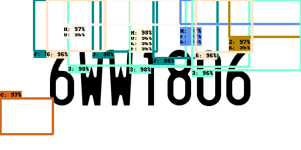

# AutomaticLP
Automatic License Plate Generation and Detection 

## Top Level Directory Guide
LPGenerator.py - Python Script to generate image sets of randomized Maryland License Plate Sequences

MatlabImplementation - All Matlab Development Code

FromScratch - Python (Keras/Tensorflow) Development and Testing

object_detection - Copy of Tensorflow Object Detection API code

TestSet - folder containing test images for older Keras implmentation (To be depreciated)

## To Do
- [ ] Better Instalation instructions, I'm not describing the protobuf install properly (& I'm not sure I fully understand)
- [ ] Figure out a better way to feed diffrent generated datasets to tools that currently need hard coded paths
- [ ] Add details about configuration file fields to modify
- [ ] Make a outline / list of configuration file fields to / can be modify as part of the tuning process
- [ ] Make a custom config file for this project
- [ ] Modify TF Record generator to accept 0 class (tensorflow dosen't like 0 being a class index)
- [ ] Determine how to automatically terminate training when a sufficient loss level is reached (or figure out a better way to terminate training which running on a remote host)
- [ ] include screenshots in directions of how to use (especially reading the tensorboard section)
- [ ] Run on MARCC
- [ ] Streamline process (figure out how to put this all in a jupyter notebook)
- [ ] Clean up git repository

## How to run

### [Installation](https://github.com/tensorflow/models/blob/master/research/object_detection/g3doc/installation.md)

#### Tensorflow
Install Tensorflow, for this we need a version 1 installation of tensorflow NOT 2.*. 

If you have tensorflow already installed check the version by running python in a terminal window and running: 

    import tensorflow as tf
    print(tf.__version__)
    
If your version of tensorflow is 2.* run 'pip uninstall tensorflow'.
If you don't have tensorflow installed or have just unistalled a 2.* version run 'pip install tensorflow=1.*'

(I am working with tensorflow 1.15.2)

#### protobuf
protobuf libraries need to be compilied - from the object_detection folder run *protoc protos/*.proto --python_out=.*
Add libraries to PYTHONPATH - run *export PYTHONPATH=$PYTHONPATH:`pwd`:`pwd`/slim*

### Generate Datasets
Datasets are generated with the LPImageGenerator.py tool. ('python LPImageGenerator.py')
Make 2 of these one for training and one for testing. The training should be 60%-80% of the total data.
  
#### Convert to TFRecord
The Tensorflow Object Detection API needs TFRecords the FromScratch/ObjectDetection.ipny notebook will convert the csvs generated by the LPImageGenerator tool to TFRecords for training

(You may have to update the directories that are pointed to for this generation)
  
 ### Training
 
 #### Setup
 Using the tensorflow object detection API training and evaluation is driven by a configuration file. 
 
 The configuration file is located in *models/model/ssd_mobilenet_v1_coco.config*
 
 #### Run Training
 I find the legacy training method to be easier to use. Run the following command from the object_detection directory:
 
 (Images for trainign are specified in the configuration file)
 
    python legacy/train.py \
    --logtostderr \
    --train_dir= <path to training output directory> \
    --pipline_config_path=../FromScratch/models/model/ssd_mobilenet_v1_coco.config

 
 My training output directory is *object_detection/trainingOutput*.
 
The training is setup to run for a very long time the anticipation based on the documentation is to watch training performance in real time through tensorboard and terminate it when an acceptable loss level is reached. 

Training can be observed through tensorboard run the following command:

    tensorboard --logdir=<path to training output directory>

### Evaluation
(Images for evaluation are specified in the configuration file)

Run the following from the object_detection directory:

    python legacy/eval.py \
    --logtostderr \
    --pipeline_config_path=../FromScratch_models/model/ssd_mobilenet_v1_coco.config \
    --checkpoint_dir=<path to training output directory> \
    --eval_dir=<path to evaluation output director>

 
My evaluation output directory is *object_detection/eval_output*
 
Use tensorboard to view the results of the evaluation 

    tensorboard --logdir=<path to evaluation output directory>
    
#### Tensorboard Outputs

##### Scalars
Scalar graphs available include: 
- Learning Rate
- mAP (mean average percision). 
    - mAP is a value between 0-100, typically the higher is better
    - Each bounding box in an image is associated with a score. Based on this score precision-recall (PR curve) is computed by varying the score threshold. The average percision (AP) is the area under the PR curve. The AP is computed for each class and then averaged resulting in the mAP. 
    - A detection is a true positive if it has an 'intersection pver union' (IoU) with a ground truth box greater than some threshold (mAP@0.5 - the 0.5 refers to the threshold value)

##### Images

(note very little training was done for this but I wanted to put a sample here)

## Refrences
Training Procedure based on [THIS](https://github.com/tensorflow/models/blob/fae6ca34c3d7aab1aff0588bab6bd467e51ef13b/research/object_detection/g3doc/running_locally.md)

Legacy Training (train.py) based on [THIS](https://pythonprogramming.net/testing-custom-object-detector-tensorflow-object-detection-api-tutorial/?completed=/training-custom-objects-tensorflow-object-detection-api-tutorial/)
and [THIS](https://towardsdatascience.com/creating-your-own-object-detector-ad69dda69c85)

[Exporting Models](https://github.com/tensorflow/models/blob/master/research/object_detection/g3doc/exporting_models.md)

[Installation Instructions](https://github.com/tensorflow/models/blob/master/research/object_detection/g3doc/installation.md)

[Tutorial 1] (https://tensorflow-object-detection-api-tutorial.readthedocs.io/en/latest/training.html#monitor-training-job-progress-using-tensorboard)

[Tutorial 2](https://becominghuman.ai/tensorflow-object-detection-api-tutorial-training-and-evaluating-custom-object-detector-ed2594afcf73)
