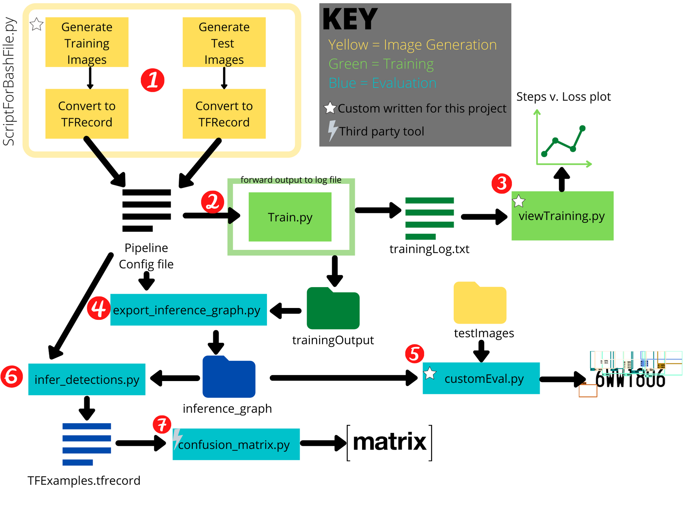

# AutomaticLP
Automatic License Plate Generation and Detection 

## Top Level Directory Guide
LPGenerator.py - Python Script to generate image sets of randomized Maryland License Plate Sequences

MatlabImplementation - All Matlab Development Code

FromScratch - Python (Keras/Tensorflow) Development and Testing

object_detection - Copy of Tensorflow Object Detection API code

TestSet - folder containing test images for older Keras implmentation (To be depreciated)

## How to run

1. Generate Datasets with LPImageGenerator.py
  * Make 2 of these one for training and one for testing. The training should be 60%-80% of the total data.
2. The Tensorflow Object Detection API needs TFRecords the FromScratch/ObjectDetection.ipny notebook will convert the csvs generated by the LPImageGenerator tool to TFRecords for training
  * You may have to update the directories that are pointed to for this generation
3. Update the configuration file with any parameter changes you have (models/model/ssd_mobilenet_v1_coco.config)
4. Run Training
  * You have 2 options for this. The legacy option (train.py) and the new option model_main.py. I'm still working out which is best.
  * To Run model_main.py execute the following from the object_detection folder:
    * *python model_main.py --pipeline_config_path=../FromScratch/models/model/ssd_mobilenet_v1_coco.config --model_dir=../AutomaticLP/FromScratch/models/model/ --num_train_steps=100 --sample_1_of_n_eval_examples=1 --alsologtos*
  * To Run train.py execute the following from the object_detection folder:
    * *python legacy/train.py --logtostderr --train_dir=../<Folder of Generated Images> --pipeline_config_path=../FromScratch/models/model/ssd_mobilenet_v1_coco.config*
  
5. launch tensorboard (*tensorboard --logdir=../FromScratch/models/model/*)
  * COMING SOON: I'm working on how to get specific info / better feedback into this 

## Refrences
Training Procedure based on [THIS](https://github.com/tensorflow/models/blob/fae6ca34c3d7aab1aff0588bab6bd467e51ef13b/research/object_detection/g3doc/running_locally.md)

Legacy Training (train.py) based on [THIS](https://pythonprogramming.net/testing-custom-object-detector-tensorflow-object-detection-api-tutorial/?completed=/training-custom-objects-tensorflow-object-detection-api-tutorial/)
and [THIS](https://towardsdatascience.com/creating-your-own-object-detector-ad69dda69c85)

[Exporting Models](https://github.com/tensorflow/models/blob/master/research/object_detection/g3doc/exporting_models.md)

